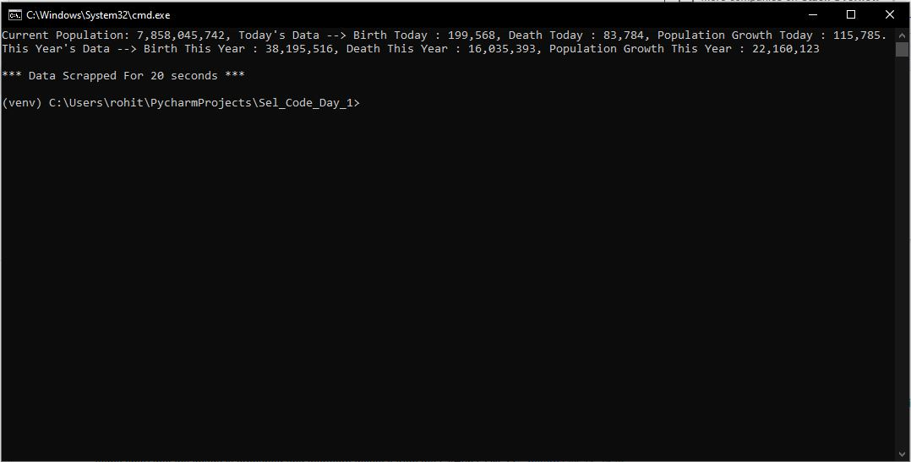

# Selenium_Challenge_Day_1
Scrap data from worldometers and print information dynamically on cmd

## Follow this steps to run this File
<li> clone this github repo in any directory you want </li>
<li> check the chrome browser version  mine is  : <i>Version 89.0.4389.114</i>  </li>
<li> run -> <b>pip install -r requirements.txt</b> to install the selenium package </li>
<li> go inside the folder and run <b>main.py</b> file from windows terminal </li>

